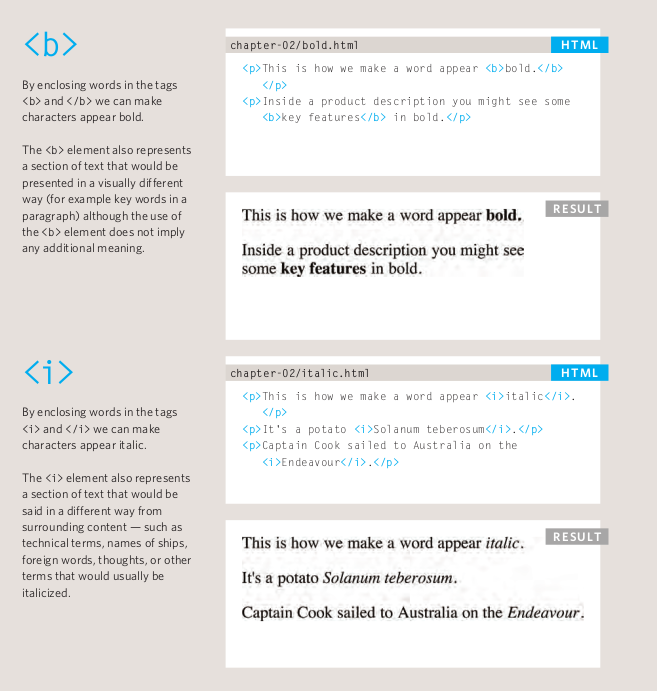
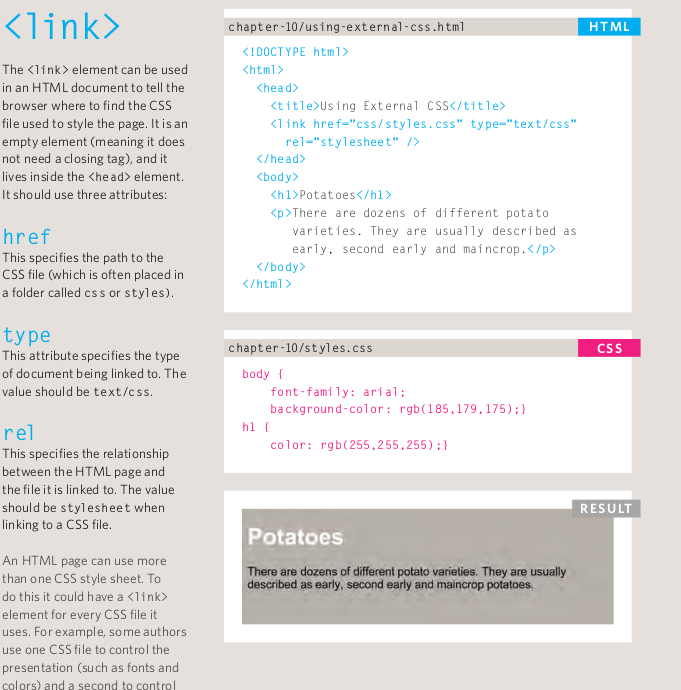

# HTML Text, CSS Introduction, and Basic JavaScript Instructions

## HTML Text:

When creating a web page, you add tags
(known as markup) to the contents of the
page. These tags provide extra meaning
and allow browsers to show users the
appropriate structure for the page.

> You will learn about:

● **Structural markup:** the elements that you can use to
describe both headings and paragraphs

● **Semantic markup:** which provides extra information; such as where emphasis is placed in a sentence, that something you have written is a quotation (and who said it), the meaning of acronyms, and so on

---

**1. Headings:**

 HTML has six "levels" of headings:

* HTML:

``` 
<h1>This is the main Heading</h1>
<h2>This is a level 2 Heading</h2>
<h3>This is a level 3 Heading</h3>
<h4>This is a level 4 Heading</h4>
<h5>This is a level 5 Heading</h5>
<h6>This is a level 6 Heading</h6>

```

* Result

# This is the main Heading

## This is a level 2 Heading

### This is a level 3 Heading

#### This is a level 4 Heading

##### This is a level 5 Heading

###### This is a level 6 Heading

--- 

**2. Paragraphs:**

To create a paragraph, surround the words that make up the paragraph with an opening tag and closing tag.

``` 
<p>Lorem ipsum dolor sit amet, consectetur adipisicing elit. Cupiditate earum dignissimos libero quaerat laudantium veritatis recusandae sint quibusdam optio voluptatum.</p>
```

Lorem ipsum dolor sit amet, consectetur adipisicing elit. Cupiditate earum dignissimos libero quaerat laudantium veritatis recusandae sint quibusdam optio voluptatum.
 
 ---
**3. Bold & Italic:**



---

## CSS Introduction:

CSS, or cascading style sheets, is the simplest of the three languages. HTML is primarily used to create the practical structure of a website. CSS, on the other hand, is used to style the elements of the webpage that are created through HTML. Colors, fonts, borders, and other characteristics are all controlled through CSS.

#### Example For Css:

``` 
.body{
    background-color: #0000ff;
    margin: 100%;
}
```

### 1. What CSS dose?

* CSS is a language that describes the style of an HTML document.
* CSS describes how HTML elements should be displayed.

### 2. How CSS works?

CSS allows you to create rules that control the
way that each individual box (and the contents
of that box) is presented.

#### Example Styles:

1. Boxes

* Width and height Borders (color, width, and style) Background color and images Position in the browser window.

1. Text

* Typeface
* Size
* Color
* Italics, bold, uppercase, 
* lowercase, small-caps

1. SPecific

* There are also specific ways in which you can style certain elements such as lists, tables, and forms.

### 3. How we can add CSS for web pages?
>it's three way:

1. Using External CSS



2. Using Internal CSS


3. CSS Selectors


## Basic JavaScript Instruction:

[home](/README.md) | [About me](/about-me.md) | [contact me](/contact-me.md)
