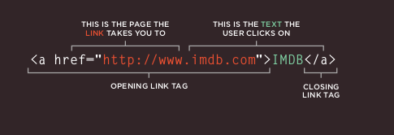
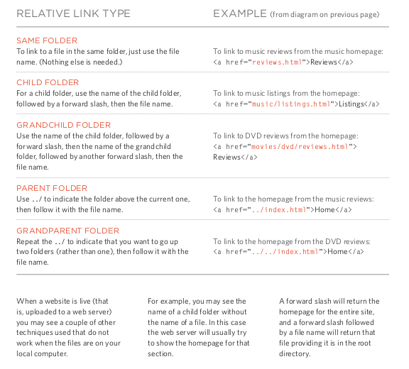
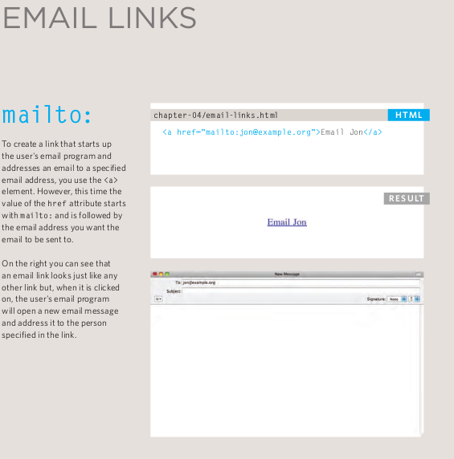
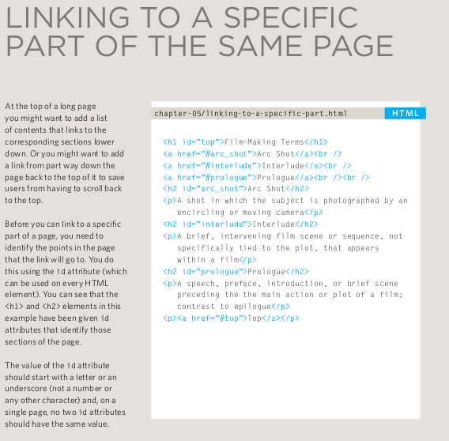
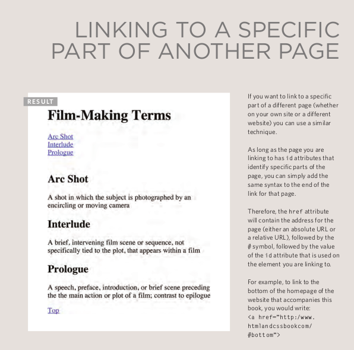

# HTML Links, CSS Layout, JS Functions

## HTML links 

>**Writing Links**

Links are created using the `<a>` element. Users can click on anything
between the opening `<a>` tag and the closing `</a>` tag. You specify
which page you want to link to using the href attribute.

>**pening Article Links in a New Window**

If you want a link to open in a new window, you can use the `target` attribute on the opening `<a>` tag. The value of this attribute should be `_blank` .

>**Relative URLs**

Relative URLs can be used when linking to pages within your own
website. They provide a shorthand way of telling the browser where to
find your files.

>**Email Links**

>**Linking to a Specific Part of the Same Page** 

>**Linking to a Specific Article Part of Another Page**

## CSS Layout 

## JS Functions 

simply its bunsh of steps that work step by step to achive goal, and its reusable

## How to creat a Function :
first of all you need to start by calling `function`, then give it a name after space like `function sleep()` *follwd with prentheses, and finly we add the curly braces `function sleep(){}` and betwin them will have the task like `function sleep(){document.write('Heloo world')};`

## Calling a Function :
after creating the function it will stay there wating for call to start, and this happen with only 1 line! by caling the function name folowed with parantheses like: `sleep();`, after excuting the function it will countinue the code at the after the same calling line...

### Function witch need information:
sometimes the function needs specafic information to use in and it will be inside the paranthases acting like varubles only inside the function.. like: `function pluse(x, y){}`, and we must let th last step of the function in this case is to return the varubles like: `function pluse(x, y){(the steps); return x + y}`
and when we call that kind of functions we must to mention the informations value inside the paranthses like: `pluse(5, 6)`

 
 

# Pair Programs :
simply “two heads are better than one”, the pair programs helps you improve the quality of your code produce

## How does it works :
the main idea depends on tow **Props**:
1. Driver :
is the programmer who is typing codes, Handling the “mechanics” of coding, manages the text editor, switching files, version control
the programmer also should had skills like: explain out loud what the code should do, listen to others’ guidance, read code that others have written, and write code themselves

2. Navigator :
who are uses their words to guide the Driver, thinks about the big picture,what comes next, how an algorithm might be converted in to code, while scanning for typos or bugs

## What Pair Programs provide to you?
- Greater efficiency
- Engaged collaboration
- Learning from fellow students
- More Social skills
- Job interview readiness
- Work environment readiness

---

[home](/README.md) | [About me](/about-me.md) | [contact me](/contact-me.md)