# HTML Images; CSS Color & Text

---
## HTML Images:

- **Choosing Images for Your Site**

  - A picture can say a thousand words, and great images help make the difference between an average-looking site and a really engaging one.

- **Storing Images on Your Site**

  - If you are building a site from scratch, it is good practice to create a folder for all of the images the site uses.

> **how we can add images**

   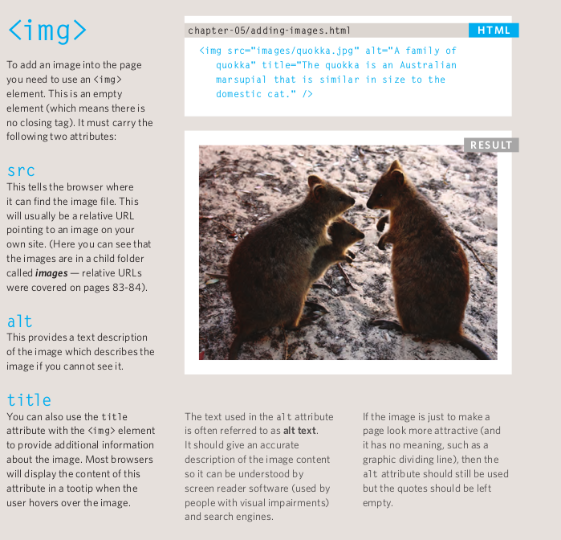

   `note`:we can control with height and width by used as attributes or in css file

> **Three Rules for Creating Images**

   - There are **three rules** to remember when you are creating images for your website which are summarized below. We go into greater detail on each topic over the next nine pages.

   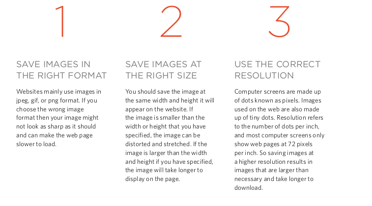

   `note`:we can use adobe photoshop to edit and save images to ensure that they are the right size,format, and resolution

> **HTML5: `Figure` and `Figure Caption`**

   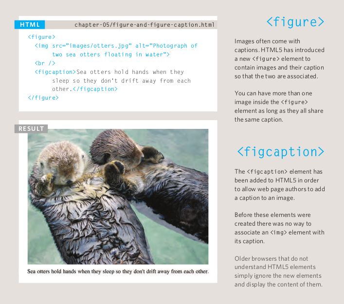
---

---
## CSS Colors:

- **Foreground Color**
  The color property allows you to specify the color of text inside an element. You can specify any color in CSS in one of three ways
  
  - **RGB values**

    These express colors in terms of how much red, green and blue are used to make it up. For example: `rgb(255,255,255)`
    
  - **HEX codes**

    These are `six-digit`    codes that represent the amount of red, green and blue in a color, preceded by a pound or hash # sign. For example: `#ee3e80`

  - **color names**
  
    There are `147` predefined color names that are recognized by browsers. For example: `DarkCyan`

 

- **Background Color**

  - CSS treats each HTML element as if it appears in a box, and the background-color property sets the color of the background for that box.

  - If you do not specify  background color, then th background is transparent.

- **Understanding Color**
   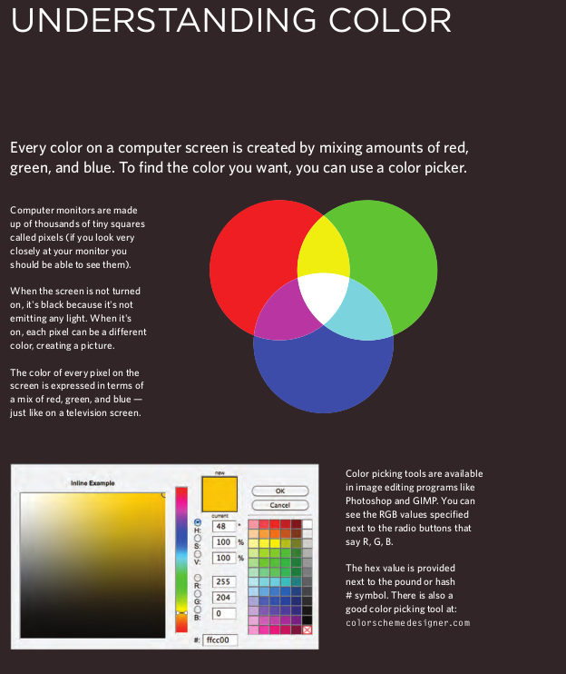 
   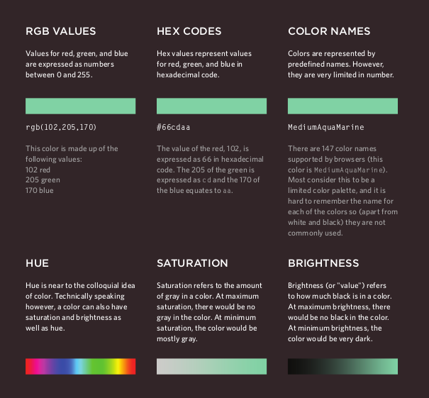

- **Contrast**
 
  When picking foreground and background colors, it is important to ensure that there is enough contrast for the text to be legible.

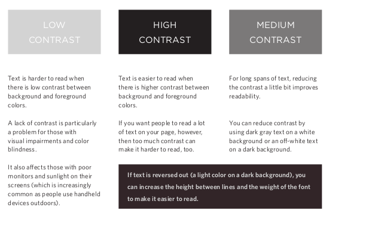

- **CSS3: Opacity**
 
  CSS3 introduces the opacity property which allows you to specify the opacity of an element and any of its child elements. The value is a number between 0.0 and 1.0 (so a value of 0.5 is 50% opacity and 0.15 is 15% opacity).

- **CSS3: HSL Colors**

  CSS3 introduces an entirely new and intuitive way to specify colors using hue, saturation, and lightness values.

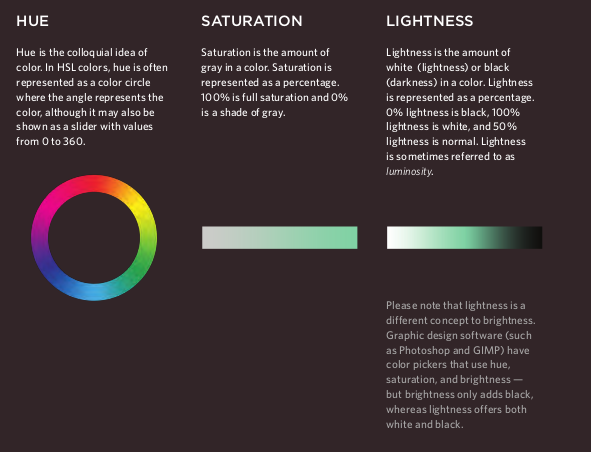
---

---
## CSS Texts:
The properties that allow you to control
the appearance of text can be split into
two groups:

   - Those that directly affect the font and its appearance (including the typeface, whether it is regular, bold or italic, and the size of the text)

   - Those that would have the same effect on text no matter what font you were using (including the color of text and the spacing between words and letters)

- **Typeface Terminology**

  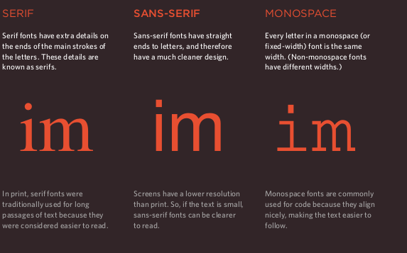
  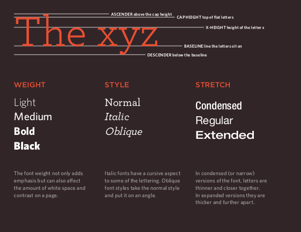

- **Choosing a Typeface for your Website**

  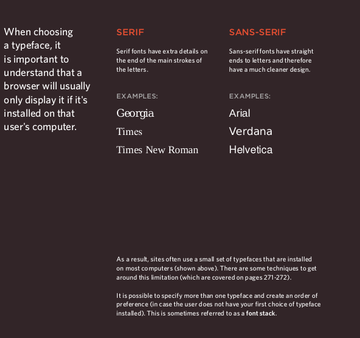
  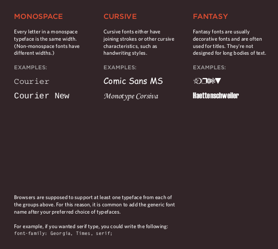

- **Specifying Typefaces**

  **`font-family`**:
  The font-family property allows   you to specify the typeface   that should be used for any   text inside the element(s) to   which a CSS rule applies.

  **`font-size`**:
  The font-size property enables you to specify a size for the font. There are several ways to specify the size of a font. The most common are:

- **Type Scales**

  You may have noticed that programs such as Word, Photoshop and InDesign offer the same sizes of text.
  
- **Units of Type Size**

  1. Pixels (px)
  2. Percentages(%)
  3. Ems(em)
  
Done
---

[home](/README.md) | [About me](/about-me.md) | [contact me](/contact-me.md)