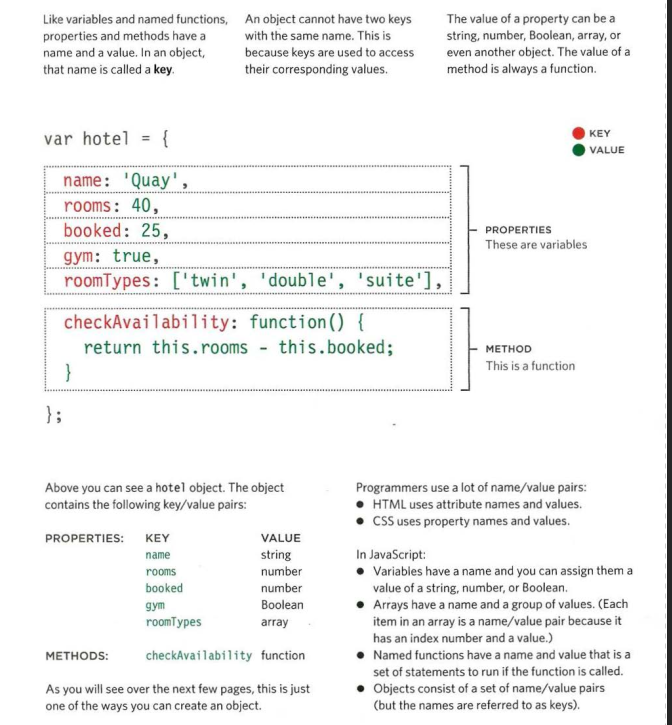
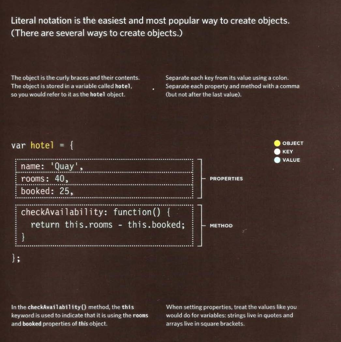
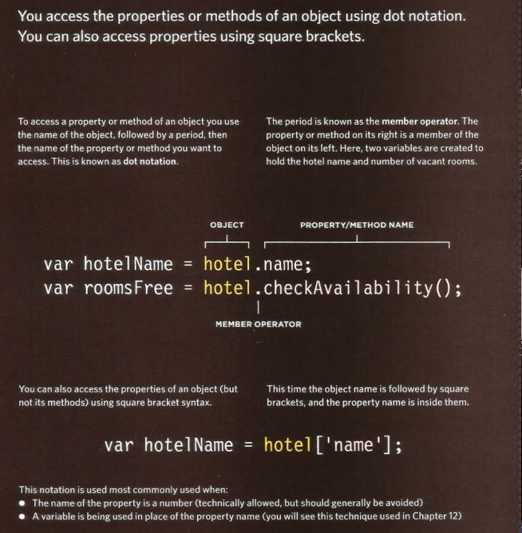
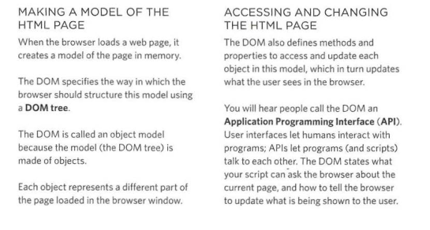
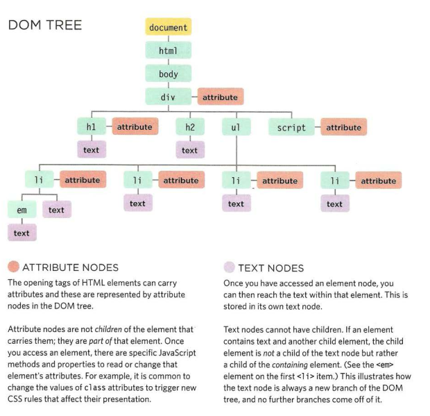
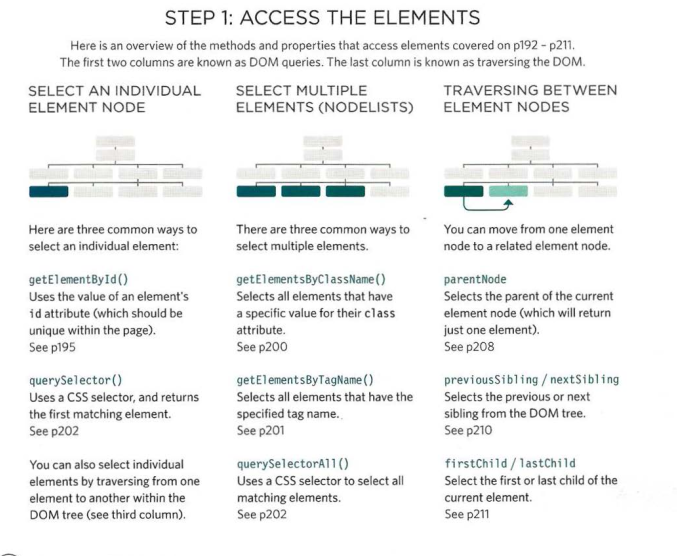
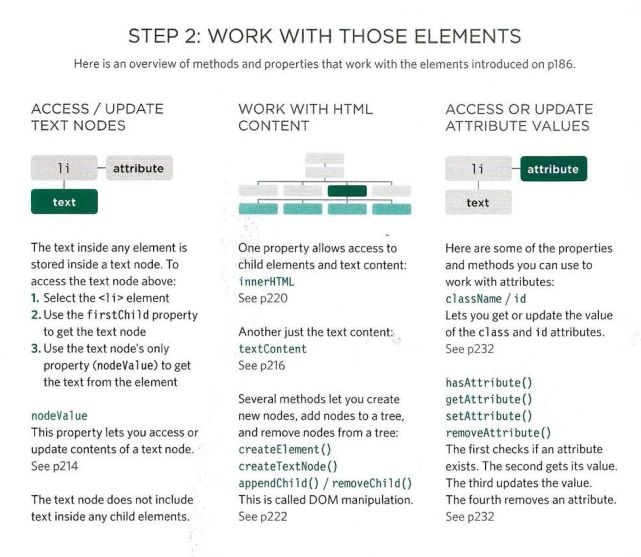
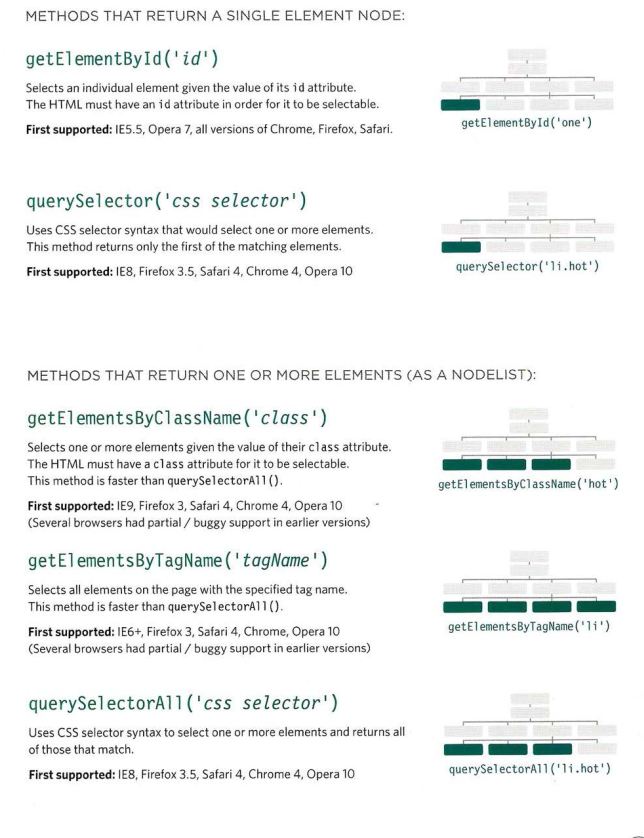

# JS Object Literals; The DOM

---
## WHAT IS AN OBJECT?
   Objects group together a set of variables and functions to create a model of a something you would recognize from the real world. In an object, variables and functions take on new names.

   - IN AN OBJECT: VARIABLES BECOME KNOWN AS PROPERTIES.
   - IN AN OBJECT: FUNCTIONS BECOME KNOWN AS METHODS.
   
   ### Example:
   This object represents a hotel. It has five properties and one method The object is in curly braces. It is stored in a variable called hotel.

### Creating an opject:
  1. Literal Notation

### Accessing an opject abd DOT Notation:

---

---
## DOCUMENT OBJECT MODLE:
  
  The Document Object Model (DOM) specifies how browsers should create a model of an HTML page and how JavaScript can access and update the contents of a web page while it is in the browser window.
  
  `note`:The DOM is neither part of HTML, nor part of JavaScript; it is a separate set of rules. It is implemented by all major browser makers, and covers two primary areas:

  

   ### DOM TREE:
   
  

   ###  WORKING WITH THE DOM TREE:
   Accessing and updating the DOM tree involves two steps: 
   
   1: Locate the node that represents the element you want to work with. 
   
   2: Use its text content, child elements, and attributes

  

 
  

  ### ACCESSING ELEMENTS:
  DOM queries may return one element, or they may return a Nodelist, which is a collection of nodes.

  

Done
---

[home](/README.md) | [About me](/about-me.md) | [contact me](/contact-me.md)