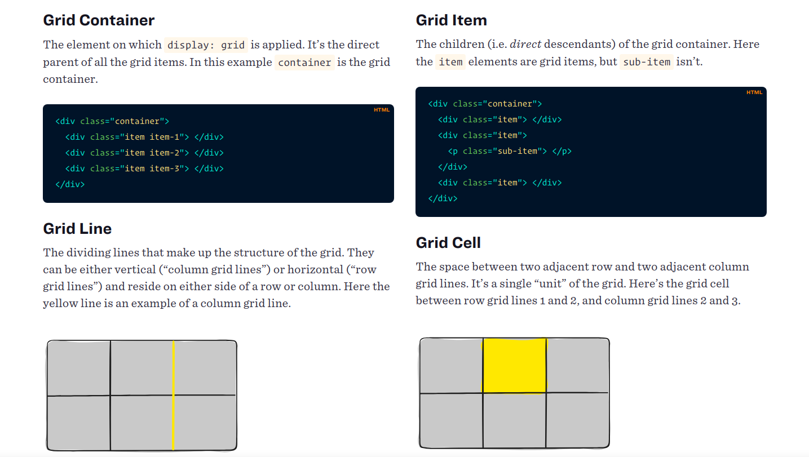
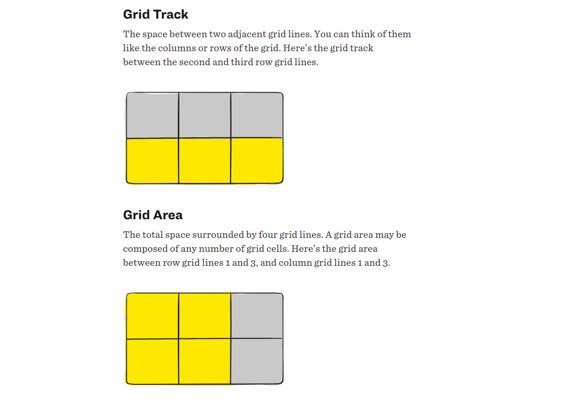
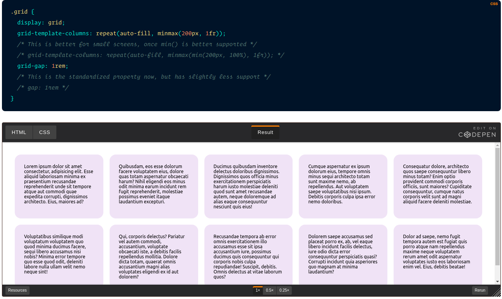
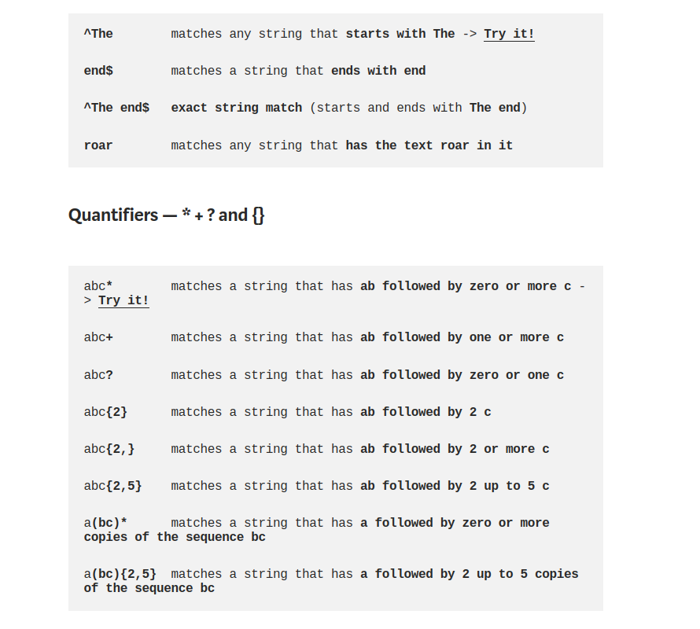

# Responsive Web Design and Regular Expressions

## Introduction Grid

---

CSS Grid Layout (aka “Grid”), is a two-dimensional grid-based layout system that aims to do nothing less than completely change the way we design grid-based user interfaces. CSS has always been used to lay out our web pages, but it’s never done a very good job of it. First, we used tables, then floats, positioning and inline-block, but all of these methods were essentially hacks and left out a lot of important functionality (vertical centering, for instance). Flexbox helped out, but it’s intended for simpler one-dimensional layouts, not complex two-dimensional ones (Flexbox and Grid actually work very well together). Grid is the very first CSS module created specifically to solve the layout problems we’ve all been hacking our way around for as long as we’ve been making websites.

### Basics and Browser support

As of March 2017, most browsers shipped native, unprefixed support for CSS Grid: Chrome (including on Android), Firefox, Safari (including on iOS), and Opera. Internet Explorer 10 and 11 on the other hand support it, but it’s an old implementation with an outdated syntax. The time to build with grid is now!

To get started you have to define a container element as a grid with display: grid, set the column and row sizes with grid-template-columns and grid-template-rows, and then place its child elements into the grid with grid-column and grid-row. Similarly to flexbox, the source order of the grid items doesn’t matter. Your CSS can place them in any order, which makes it super easy to rearrange your grid with media queries. Imagine defining the layout of your entire page, and then completely rearranging it to accommodate a different screen width all with only a couple lines of CSS. Grid is one of the most powerful CSS modules ever introduced.

### Important Terminology

Before diving into the concepts of Grid it’s important to understand the terminology. Since the terms involved here are all kinda conceptually similar, it’s easy to confuse them with one another if you don’t first memorize their meanings defined by the Grid specification. But don’t worry, there aren’t many of them.

### the Most Powerful Line in Grid

Fluid width columns that break into more or less columns as space is available, with no media queries!

---

## Regular Expressions

UPDATE! Check out my new REGEX COOKBOOK about the most commonly used (and most wanted) regex 🎉
Regular expressions (regex or regexp) are extremely useful in extracting information from any text by searching for one or more matches of a specific search pattern (i.e. a specific sequence of ASCII or unicode characters).
Fields of application range from validation to parsing/replacing strings, passing through translating data to other formats and web scraping.
One of the most interesting features is that once you’ve learned the syntax, you can actually use this tool in (almost) all programming languages ​​(JavaScript, Java, VB, C #, C / C++, Python, Perl, Ruby, Delphi, R, Tcl, and many others) with the slightest distinctions about the support of the most advanced features and syntax versions supported by the engines).
Let’s start by looking at some examples and explanations.

---

[home](/README.md) | [About me](/about-me.md) | [contact me](/contact-me.md)