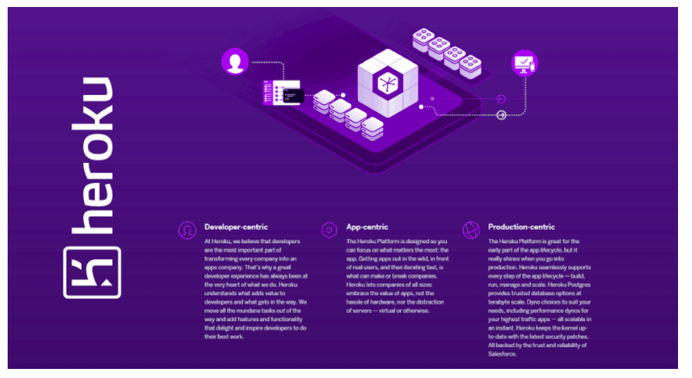

# Heroku Deployment

Heroku is a cloud platform that lets companies build, deliver, monitor and scale apps — we're the fastest way to go from idea to URL, bypassing all those infrastructure headaches.

> ### learn how to get the most out of the Heroku platform

- Set up
- install the Heroku Command Line Interface (CLI).
- Prepare the app
- In this step, you will prepare a sample application that’s ready to be deployed to Heroku.
- If you are new to Heroku, it is recommended that you complete this tutorial using the Heroku-provided sample application.
- Deploy the app
- View logs
- Define a Procfile
- Scale the app
- Declare app dependencies
- Run the app locally
- Push local changes
- Provision add-ons
- Start a console
- Define config vars
- Provision a database
- Next steps

##  Summary

- Apps are transformative — apps are how customers now engage with companies.

- Developers are critical to app success.

- Security and operations are what Heroku does well — we do this to allow companies to focus on what matters: the app.

- Data is at the heart of any app — and Heroku provides a secure, scalable database-as-a-service.

- Ecosystems matter - Heroku provides over 175 Add-ons with which to instantly extend applications

- Enterprise level controls lets companies support and manage portfolios of applications.

- Heroku grows with the needs of evolving businesses, offering flexible pricing for apps and organizations of all sizes.

- Seamless Heroku and Salesforce data synchronization makes it easy to build innovative apps that span both platforms.

 if you want know [more about Heroku](https://www.heroku.com/what#summary)

---

[home](/README.md) | [About me](/about-me.md) | [contact me](/contact-me.md)