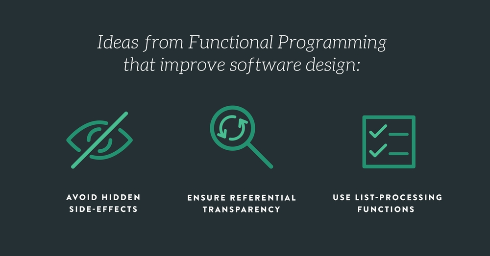

# FUNCTIONAL PROGRAMMING
**What is functional programming?**

Functional programming is a programming paradigm, a style of building the structure and elements of computer programs that treats computation as the evaluation of mathematical functions and avoids changing-state and mutable data. 

 

- **Pure functions** 
  - It returns the same result if given the same arguments (it is also referred as deterministic).
  - It does not cause any observable side effects.

**Pure functions benefits**

The code’s definitely easier to test. So we can unit test pure functions with different contexts.

**Immutability**

Unchanging over time or unable to be changed. When data is immutable, its state cannot change after it’s created. If you want to change an immutable object, you can’t. Instead, you create a new object with the new value. In Javascript we commonly use the for loop. This next for statement has some mutable variables. 

**Functions as first-class entities**

The idea of functions as first-class entities is that functions are also treated as values and used as data.

Functions as first-class entities can:
- refer to it from constants and variables
- pass it as a parameter to other functions
- return it as result from other functions

The idea is to treat functions as values and pass functions like data. This way we can combine different functions to create new functions with new behavior.

**Higher-order functions**

When we talk about higher-order functions, we mean a function that either:
- takes one or more functions as arguments, or
- returns a function as its result

**Filter**

The filter function expects a true or false value to determine if the element should or should not be included in the result collection. Basically, if the callback expression is true, the filter function will include the element in the result collection.

**Map**

The idea of map is to transform a collection. The map method transforms a collection by applying a function to all of its elements and building a new collection from the returned values.

**Reduce**

The idea of reduce is to receive a function and a collection, and return a value created by combining the items.

---

[home](/README.md) | [About me](/about-me.md) | [contact me](/contact-me.md)