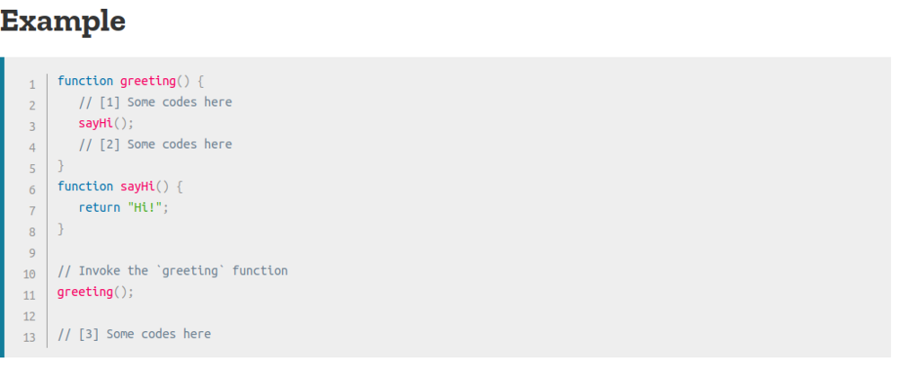

# THE CALL STACK

**A call stack** 
is a mechanism for an interpreter (like the JavaScript interpreter in a web browser) to keep track of its place in a script that calls multiple functions — what function is currently being run and what functions are called from within that function, etc.
- When a script calls a function, the interpreter adds it to the call stack and then starts carrying out the function.
- Any functions that are called by that function are added to the call stack further up, and run where their calls are reached.
- When the current function is finished, the interpreter takes it off the stack and resumes execution where it left off in the last code listing.
- If the stack takes up more space than it had assigned to it, it results in a "stack overflow" error.4

 

**The JavaScript Call Stack - What It Is and Why It's Necessary**

The JavaScript engine (which is found in a hosting environment like the browser), is a single-threaded interpreter comprising of a heap and a single call stack. The browser provides web APIs like the DOM, AJAX, and Timers.

The call stack is primarily used for function invocation (call). Since the call stack is single, function(s) execution, is done, one at a time, from top to bottom. It means the call stack is synchronous.

The understanding of the call stack is vital to Asynchronous programming.

In Asynchronous JavaScript, we have a callback function, an event loop, and a task queue. The callback function is acted upon by the call stack during execution after the call back function has been pushed to the stack by the event loop.

At the most basic level, a call stack is a data structure that uses the Last In, First Out (LIFO) principle to temporarily store and manage function invocation (call).

**What causes a stack overflow?**

A stack overflow occurs when there is a recursive function (a function that calls itself) without an exit point. The browser (hosting environment) has a maximum stack call that it can accomodate before throwing a stack error.

**JavaScript error messages**

**Types of error messages**

The first thing that indicates you that something is wrong with your code is the (in)famous error message , it usually appears on your console (being developer tools of the browser, terminal or whatever else you are using).

**Reference errors**

This is as simple as when you try to use a variable that is not yet declared you get this type os errors.

**Syntax errors**

This occurs when you have something that cannot be parsed in terms of syntax, like when you try to parse an invalid object using JSON.parse.

**Range errors**

That's happen when we try to manipulate an object with some kind of length and give it an invalid length.

**Type errors**

This types of errors show up when the types (number, string and so on) you are trying to use or access are incompatible, like accessing a property in an undefined type of variable.

---

[home](/README.md) | [About me](/about-me.md) | [contact me](/contact-me.md)