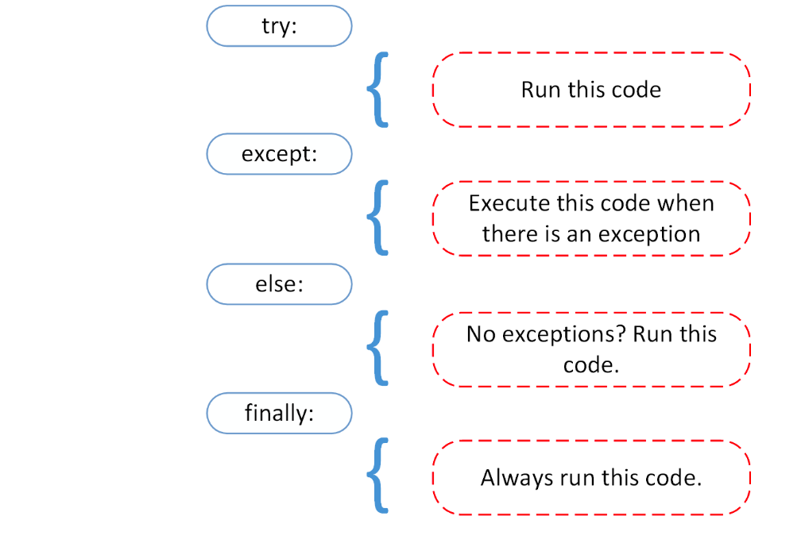

 
# FileIO & Exceptions
 
 ## Reading and Writing Files in Python
  
  ### What Is a File?
  
   Files on most modern file systems are composed of three  main parts:
 
   * Header: metadata about the contents of the file (file name, size, type, and so on)
 
   * Data: contents of the file as written by the creator or editor
 
   * End of file (EOF): special character that indicates the end of the file
 
  ### File Paths
 
   The file path is a string that represents the location of a file. contain three major parts:
 
   * Folder Path: the file folder location on the file system where subsequent folders are separated by a forward slash / (Unix) or backslash \ (Windows)
 
   * File Name: the actual name of the file
   
   * Extension: the end of the file path pre-pended with a period (.) used to indicate the file type
 
 
  ### Character Encodings
   An encoding is a translation from byte data to human readable characters. 
 
   two common types of encoding:
 
   * ASCII
 
   * UNICODE
 
 
  ### Opening and Closing a File in Python
   `file = open('dog_breeds.txt')`
 
  ### Reading and Writing Opened Files
   Method | What it Does
   -------|----------
   .read(size=-1) | This reads from the file based on the number of size bytes. If no argument is passed or None or -1 is passed, then the entire file is read.
   .readline(size=-1) | This reads at most size number of characters from the line. This continues to the end of the line and then wraps back around. If no argument is passed or None or -1 is passed, then the entire line (or rest of the line) is read.
   .readlines() |  This reads the remaining lines from the file object and returns them as a list.
 
 
 
  ## Python Exceptions: An Introduction
  
  ### Exceptions versus Syntax Errors
   **Syntax** errors occur when the parser detects an incorrect statement.Where **exception** error This type of error occurs whenever syntactically correct Python code results in an error. 
  
  ### The try and except Block: Handling Exceptions
   The try and except block in Python is used to catch and handle exceptions.
  
  ### The else Clause
   In Python, using the else statement, you can instruct a program to execute a certain block of code only in the absence of exceptions.
  
   example :
   ```
   try:
       linux_interaction()
   except AssertionError as error:
       print(error)
   else:
       print('Executing the else clause.')
   ```
  
  ## Cleaning Up After Using finally
   Imagine that you always had to implement some sort of action to clean up after executing your code. Python enables you to do so using the finally clause.
 
   
Done
---
 
[home](../README.md) | [About me](../about-me.md) | [contact me](../contact-me.md)