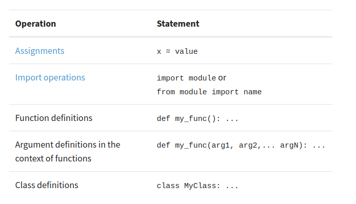

# Game of Greed 2

The concept of scope rules how variables and names are looked up in your code. It determines the visibility of a variable within the code. The scope of a name or variable depends on the place in your code where you create that variable. The Python scope concept is generally presented using a rule known as the ***LEGB*** rule.

The letters in the acronym LEGB stand for `Local`, `Enclosing`, `Global`, and `Built-in` scopes. This summarizes not only the Python scope levels but also the sequence of steps that Python follows when resolving names in a program

## Understanding Scope

In programming, the scope of a name defines the area of a program in which you can unambiguously access that name, such as variables, functions, objects, and so on. A name will only be visible to and accessible by the code in its scope. Several programming languages take advantage of scope for avoiding name collisions and unpredictable behaviors. Most commonly, you’ll distinguish two general scopes:

1. ***Global scope***: The names that you define in this scope are available to all your code.

1. ***Local scope***: The names that you define in this scope are only available or visible to the code within the scope.

> Note: You’ll be using the term name to refer to the identifiers of variables, constants, functions, classes, or any other object that can be assigned a name.

---

### Names and Scopes in Python
Since Python is a [dynamically-typed](https://wiki.python.org/moin/Why%20is%20Python%20a%20dynamic%20language%20and%20also%20a%20strongly%20typed%20language) language, variables in Python come into existence when you first assign them a value. On the other hand, functions and classes are available after you define them using [def](https://docs.python.org/3/reference/compound_stmts.html#def) or [class](https://docs.python.org/3/reference/compound_stmts.html#class-definitions), respectively. Finally, [modules](https://docs.python.org/3/glossary.html#term-module) exist after you import them. As a summary, you can create Python names through one of the following operations:




## Using the LEGB Rule for Python Scope

Python resolves names using the so-called LEGB rule, which is named after the Python scope for names. The letters in LEGB stand for Local, Enclosing, Global, and Built-in. Here’s a quick overview of what these terms mean:

  - ***Local (or function) scope*** is the code block or body of any Python function or lambda expression. This Python scope contains the names that you define inside the function. These names will only be visible from the code of the function. It’s created at function call, not at function definition, so you’ll have as many different local scopes as function calls. This is true even if you call the same function multiple times, or recursively. Each call will result in a new local scope being created.

  - ***Enclosing (or nonlocal) scope*** is a special scope that only exists for nested functions. If the local scope is an inner or nested function, then the enclosing scope is the scope of the outer or enclosing function. This scope contains the names that you define in the enclosing function. The names in the enclosing scope are visible from the code of the inner and enclosing functions.

  - ***Global (or module) scope*** is the top-most scope in a Python program, script, or module. This Python scope contains all of the names that you define at the top level of a program or a module. Names in this Python scope are visible from everywhere in your code.

  - ***Built-in scope*** is a special Python scope that’s created or loaded whenever you run a script or open an interactive session. This scope contains names such as keywords, functions, exceptions, and other attributes that are built into Python. Names in this Python scope are also available from everywhere in your code. It’s automatically loaded by Python when you run a program or script.

The LEGB rule is a kind of name lookup procedure, which determines the order in which Python looks up names. For example, if you reference a given name, then Python will look that name up sequentially in the local, enclosing, global, and built-in scope. If the name exists, then you’ll get the first occurrence of it. Otherwise, you’ll get an error.

> Note: Notice that the local and enclosing Python scopes are searched only if you use a name inside a function (local scope) or a nested or inner function (local and enclosing scope).

---

## Modifying the Behavior of a Python Scope

So far, you’ve learned how a Python scope works and how they restrict the visibility of variables, functions, classes, and other Python objects to certain portions of your code. You now know that you can access or reference **gobal names** from any place in your code, but they can be modified or updated from within the global Python scope.

You also know that you can access **local names** only from inside the local Python scope they were created in or from inside a nested function, but you can’t access them from the global Python scope or from other local scopes. Additionally, you’ve learned that **nonlocal names** can be accessed from inside nested functions, but they can’t be modified or updated from there.

Even though Python scopes follow these general rules by default, there are ways to modify this standard behavior. Python provides two keywords that allow you to modify the content of global and nonlocal names. These two keywords are:

  1. global
  1. nonlocal

## The global Statement

You already know that when you try to assign a value to a global name inside a function, you create a new local name in the function scope. To modify this behavior, you can use a **global statement**. With this statement, you can define a list of names that are going to be treated as global names.

```
>>> counter = 0  # A global name
>>> def update_counter():
...     global counter  # Declare counter as global
...     counter = counter + 1  # Successfully update the counter
...
>>> update_counter()
>>> counter
1
>>> update_counter()
>>> counter
2
>>> update_counter()
>>> counter
3
```
## Using Enclosing Scopes as Closures

Closures are a special use case of the enclosing Python scope. When you handle a nested function as data, the statements that make up that function are packaged together with the environment in which they execute. The resulting object is known as a closure. In other words, a closure is an inner or nested function that carries information about its enclosing scope, even though this scope has completed its execution.

> Note: You can also call this kind of function a factory, a factory function, or—to be more precise—a closure factory to specify that the function builds and returns closures (an inner function), rather than classes or instances.

```
>>> def power_factory(exp):
...     def power(base):
...         return base ** exp
...     return power
...
>>> square = power_factory(2)
>>> square(10)
100
>>> cube = power_factory(3)
>>> cube(10)
1000
>>> cube(5)
125
>>> square(15)
225
```

## Bringing Names to Scope With import

When you write a Python program, you typically organize the code into several modules. For your program to work, you’ll need to bring the names in those separate modules to your `__main__` module. To do that, you need to import the modules or the names explicitly. This is the only way you can use those names in your main global Python scope.

Take a look at the following code for an example of what happens when you import some standard modules and names:

```
>>> dir()
['__annotations__', '__builtins__',..., '__spec__']
>>> import sys
>>> dir()
['__annotations__', '__builtins__',..., '__spec__', 'sys']
>>> import os
>>> dir()
['__annotations__', '__builtins__',..., '__spec__', 'os', 'sys']
>>> from functools import partial
>>> dir()
['__annotations__', '__builtins__',..., '__spec__', 'os', 'partial', 'sys']

```
You first import sys and os from the Python standard library. By calling dir() with no arguments, you can see that these modules are now available for you as names in your current global scope. This way, you can use dot notation to get access to the names that are defined in sys and os.

## Discovering Unusual Python Scopes

You’ll find some Python structures where name resolution seems not to fit into the LEGB rule for Python scopes. These structures include:

  - [Comprehensions](https://realpython.com/courses/using-list-comprehensions-effectively/)
  - [Exception blocks](https://realpython.com/courses/introduction-python-exceptions/)
  - [Classes and instances](https://realpython.com/courses/intro-object-oriented-programming-oop-python/)

In the next few sections, you’ll cover how Python scope works on these three structures. With this knowledge, you’ll be able to avoid subtle errors related to the use of names in these kinds of Python structures.

## Using Scope Related Built-In Functions

There are many built-in functions that are closely related to the concept of Python scope and namespaces. In previous sections, you’ve used dir() to get information on the names that exist in a given scope. Besides dir(), there are some other built-in functions that can help you out when you’re trying to get information about a Python scope or namespace. In this section, you’ll cover how to work with:

  - [globals()](https://docs.python.org/3/library/functions.html#globals)
  - [locals()](https://docs.python.org/3/library/functions.html#locals)
  - [dir()](https://docs.python.org/3/library/functions.html#dir)
  - [vars()](https://docs.python.org/3/library/functions.html#vars)

Since all these are built-in functions, they’re available for free in the built-in scope. This means that you can use them at any time without importing anything. Most of these functions are intended to be used in an interactive session to get information on different Python objects. However, you can find some interesting use cases for them in your code as well.

## ***references:***
1. [Python Scope & the LEGB Rule](https://realpython.com/python-scope-legb-rule/)


Done
---
 
[home](../README.md) | [About me](../about-me.md) | [contact me](../contact-me.md)