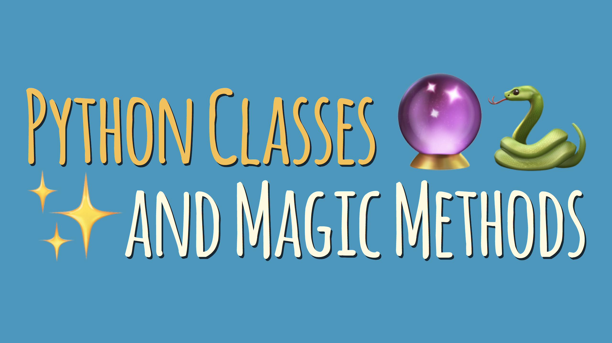
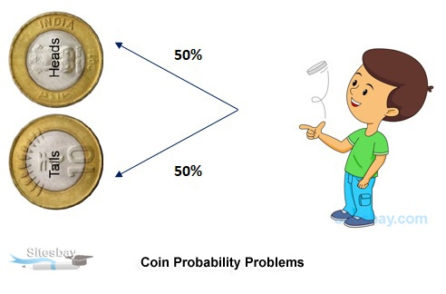

# Dunder **Magic** , **Special** Methods

## What Are Dunder Methods?
In Python, special methods are a set of predefined methods you can use to enrich your classes. They are easy to recognize because they start and end with double underscores, for example __init__ or __str__.

Dunder methods let you emulate the behavior of built-in types. For example, to get the length of a string you can call len('string'). But an empty class definition doesn’t support this behavior out of the box:

`__repr__`: The “official” string representation of an object. This is how you would make an object of the class. The goal of `__repr__` is to be unambiguous.

`__str__`: The “informal” or nicely printable string representation of an object. This is for the enduser.

## Statistics - Probability

### What is probability?
At the most basic level, probability seeks to answer the question, “What is the chance of an event happening?” An event is some outcome of interest. To calculate the chance of an event happening, we also need to consider all the other events that can occur. The quintessential representation of probability is the humble coin toss. In a coin toss the only events that can happen are:

1. Flipping a heads

1. Flipping a tails

These two events form the sample space, the set of all possible events that can happen. To calculate the probability of an event occurring, we count how many times are event of interest can occur (say flipping heads) and dividing it by the sample space. Thus, probability will tell us that an ideal coin will have a 1-in-2 chance of being heads or tails. By looking at the events that can occur, probability gives us a framework for making predictions about how often events will happen. However, even though it seems obvious, if we actually try to toss some coins, we’re likely to get an abnormally high or low counts of heads every once in a while. If we don’t want to make the assumption that the coin is fair, what can we do? We can gather data! We can use statistics to calculate probabilities based on observations from the real world and check how it compares to the ideal.

## ***references:***
**read**
1. [Dunder Methods](https://dbader.org/blog/python-dunder-methods)
1. [Statistics - Probability](https://www.dataquest.io/blog/basic-statistics-in-python-probability/)
**vedio**
1. [Intro to Statistics](https://www.youtube.com/watch?v=MdHtK7CWpCQ)
1. [AI Guru makes $238,800 with misleading paid course. doesn’t credit developers](https://www.youtube.com/watch?v=7jmBE4yPrOs)

Done
---
 
[home](../README.md) | [About me](../about-me.md) | [contact me](../contact-me.md)