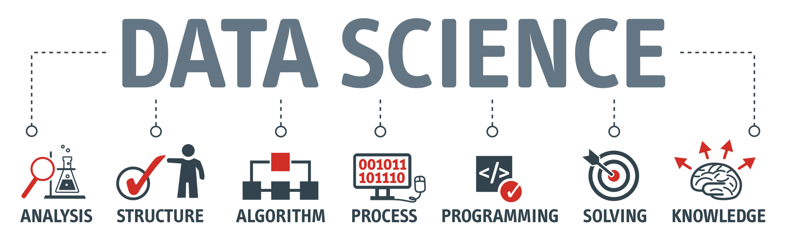
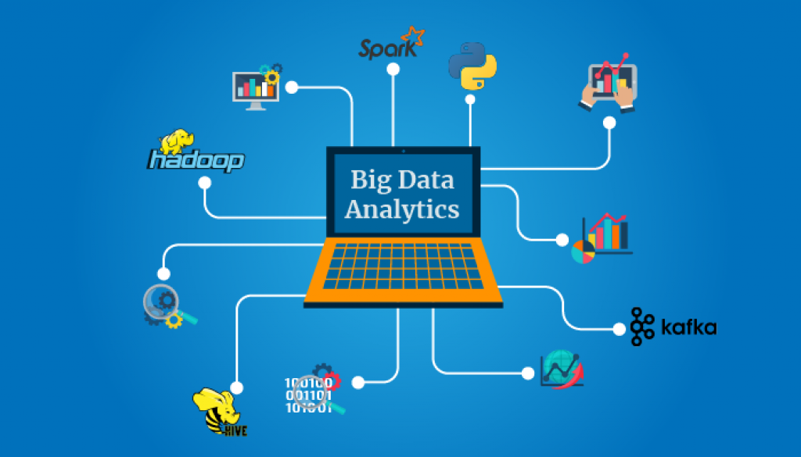
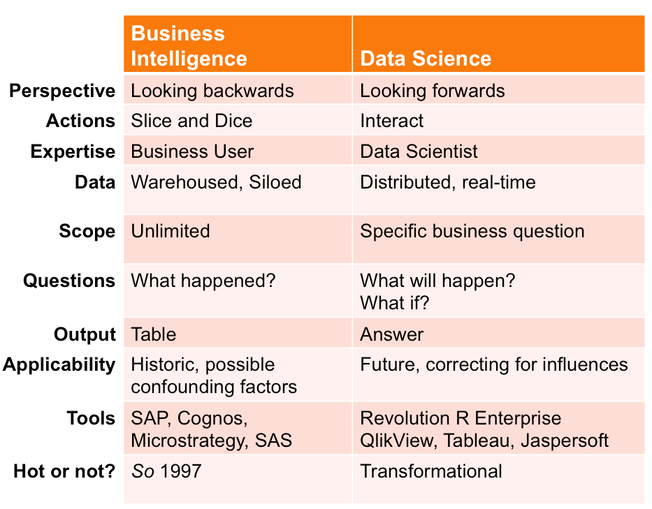

# Data Science

It is a set of disciplines and practices that handle data in a scientific manner. The foundations of data science are mostly Mathematics and Statistics, sometimes Software Engineering would play a role as well.

Usually, it includes but not limited to these steps:
1. Data acquisition
2. Data cleaning & wrangling
3. Data Engineering
4. Utilization of data

### Data acquisition
To play with data, you need to have data first.
The data could be in the form of .CSV files. Excel file (.XLSX) is a typical form, or it could be available by API calls, or someone has done the dirty work already and they are all in DWH(Data WareHouse) or Data Lake.

In addition, web scraping is also one way to go as well. Web scraping is useful when you need to acquire data that CSV export and API method are not viable (especially for business competitors’ data). My best friend Anastasia Reusova wrote an article for this topic. Free free to check that out if you are interested to learn the details.

### Data cleaning & wrangling
In the actual working environment, data is rarely ready to be used right away.
Data could be in the nested structure for storage saving purpose (e.g. Bigquery and NoSQL), could be normalized (like general databases). The data need to be flattened before usage.
Or, the application generating data went haywire and polluted the data recently. That would require sanity checking and data cleaning as well.
This is usually the most time-consuming and painful part for Data Scientists, Analysts and Data Engineers. Roughly 60~80% of the data science people’s time goes to this part, 10% goes to meetings & presentation and only the rest for the sexiest part: playing with algorithms.

### Data Engineering

Simply put, the point of Data Engineering is building a stable and reliable architecture for data storage and consumption. It is a extremely vital part as all kinds of data science tricks depends on it.
If there is no good data to use, NONE of the data science gimmicks could work.
Well engineered data should be clean, fast and cheap (in terms of computational resources, hence money as well) for robust consumption right away.

### Utilization of data
This is the sexy part that people couldn’t stop talking about.
From traditional consumption like building an application, doing ad hoc analysis, dashboarding and the recent fancy thing such as Machine Learning, this is the step people care so much.
There will be more articles covering this part, stay tuned for more.

## Big Data :
Big enough to make it impossible for a regular laptop to process. Hence, solutions like Google Bigquery, Hadoop and MapReduce are introduced..

## Analytics & Business Intelligence :
they are very alike when it comes to practices in a business context..

## Machine Learning :
is like human learning new knowledge. Human picks up new knowledge through experience, machines pick up new knowledge with data,

Machine Learning aims at building algorithms, and algorithms can be divided into 2 categories: Supervised Learning and Unsupervised Learning, focus on tabular data.

## Deep Learning :
has a lot of connections with Machine Learning, but they are not exactly the same thing in practice,handles untraditional data such as images, text, voice recordings. Deep Learning algorithms work on computer vision, speech recognition, NLP (Natural Language Processing) and so on. Famous language learning app Duolingo obviously uses a lot of Deep Learning to teach languages better

Done
---
 
[home](../README.md) | [About me](../about-me.md) | [contact me](../contact-me.md)