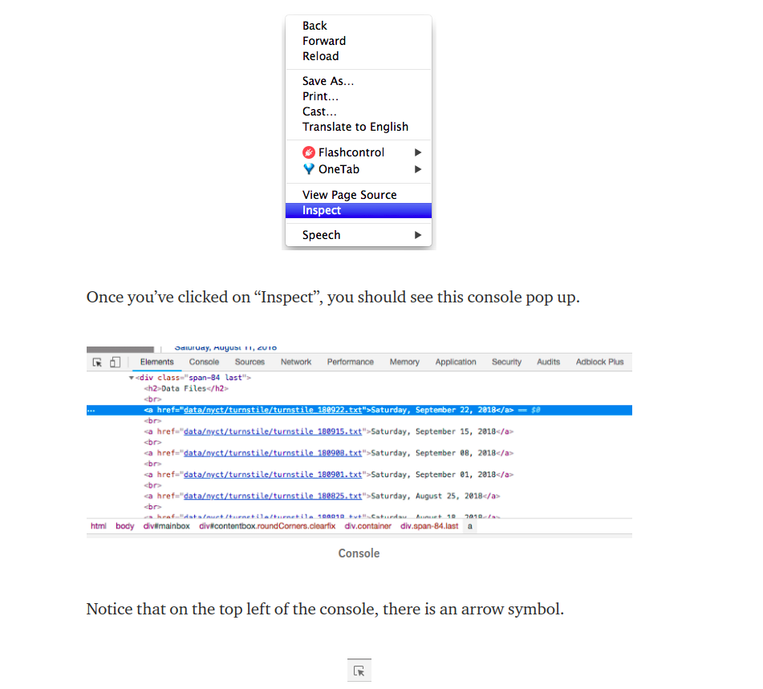

# Web Scraping


Web scraping is a technique to automatically access and extract large amounts of information from a website, which can save a huge amount of time and effort. In this article, we will go through an easy example of how to automate downloading hundreds of files from the New York MTA. This is a great exercise for web scraping beginners who are looking to understand how to web scrape. Web scraping can be slightly intimidating, so this tutorial will break down the process of how to go about the process.

### Important notes about web scraping:

* Read through the website’s Terms and Conditions to understand how you can legally use the data. Most sites prohibit you from using the data for commercial purposes.

* Make sure you are not downloading data at too rapid a rate because this may break the website. You may potentially be blocked from the site as well.

### Inspecting the Website

first thing that we need to do is to figure out where we can locate the links to the files we want to download inside the multiple levels of HTML tags. Simply put, there is a lot of code on a website page and we want to find the relevant pieces of code that contains our data. If you are not familiar with HTML tags, refer to W3Schools Tutorials. It is important to understand the basics of HTML in order to successfully web scrape.

> On the website, right click and click on “Inspect”. This allows you to see the raw code behind the site.



If you click on this arrow and then click on an area of the site itself, the code for that particular item will be highlighted in the console. I’ve clicked on the very first data file, Saturday, September 22, 2018 and the console has highlighted in blue the link to that particular file.

``` 
<a href=”data/nyct/turnstile/turnstile_180922.txt”>Saturday, September 22, 2018</a>
```

Notice that all the .txt files are inside the `<a>` tag following the line above. As you do more web scraping, you will find that the `<a>` is used for hyperlinks.

## ***references:***

***read***

1. [Web Scrape with Python in 4 minutes](https://towardsdatascience.com/how-to-web-scrape-with-python-in-4-minutes-bc49186a8460)
1. [What is Web Scraping?](https://en.wikipedia.org/wiki/Web_scraping)
1. [Beautiful Soup](https://www.crummy.com/software/BeautifulSoup/)

***vedio***

1. [Track Amazon Prices](https://www.youtube.com/watch?v=Bg9r_yLk7VY)

Done
---
 
[home](../README.md) | [About me](../about-me.md) | [contact me](../contact-me.md)
