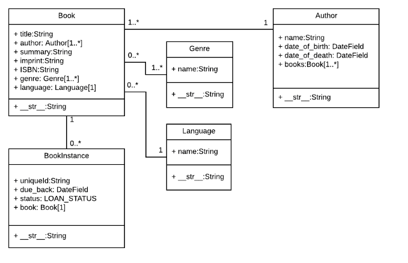

# Django Models

Django web applications access and manage data through Python objects referred to as models. Models define the structure of stored data, including the field types and possibly also their maximum size, default values, selection list options, help text for documentation, label text for forms, etc. The definition of the model is independent of the underlying database — you can choose one of several as part of your project settings. Once you've chosen what database you want to use, you don't need to talk to it directly at all — you just write your model structure and other code, and Django handles all the dirty work of communicating with the database for you.

### Designing the LocalLibrary models

Before you jump in and start coding the models, it's worth taking a few minutes to think about what data we need to store and the relationships between the different objects.

We know that we need to store information about books (title, summary, author, written language, category, ISBN) and that we might have multiple copies available (with globally unique id, availability status, etc.). We might need to store more information about the author than just their name, and there might be multiple authors with the same or similar names. We want to be able to sort information based on book title, author, written language, and category.

When designing your models it makes sense to have separate models for every "object" (a group of related information). In this case, the obvious objects are books, book instances, and authors.

You might also want to use models to represent selection-list options (e.g. like a drop down list of choices), rather than hard coding the choices into the website itself — this is recommended when all the options aren't known up front or may change. Obvious candidates for models, in this case, include the book genre (e.g. Science Fiction, French Poetry, etc.) and language (English, French, Japanese).

Once we've decided on our models and field, we need to think about the relationships. Django allows you to define relationships that are one to one (OneToOneField), one to many (ForeignKey) and many to many (ManyToManyField).

With that in mind, the UML association diagram below shows the models we'll define in this case (as boxes).



We've created models for the book (the generic details of the book), book instance (status of specific physical copies of the book available in the system), and author. We have also decided to have a model for the genre so that values can be created/selected through the admin interface. We've decided not to have a model for the BookInstance:status — we've hardcoded the values (LOAN_STATUS) because we don't expect these to change. Within each of the boxes, you can see the model name, the field names, and types, and also the methods and their return types.

The diagram also shows the relationships between the models, including their multiplicities. The multiplicities are the numbers on the diagram showing the numbers (maximum and minimum) of each model that may be present in the relationship. For example, the connecting line between the boxes shows that Book and a Genre are related. The numbers close to the Genre model show that a book must have one or more Genres (as many as you like), while the numbers on the other end of the line next to the Book model show that a Genre can have zero or many associated books.

### Model definition

Models are usually defined in an application's models.py file. They are implemented as subclasses of django.db.models.Model, and can include fields, methods and metadata. The code fragment below shows a "typical" model, named MyModelName:

```
from django.db import models

class MyModelName(models.Model):
    """A typical class defining a model, derived from the Model class."""

    # Fields
    my_field_name = models.CharField(max_length=20, help_text='Enter field documentation')
    ...

    # Metadata
    class Meta:
        ordering = ['-my_field_name']

    # Methods
    def get_absolute_url(self):
        """Returns the url to access a particular instance of MyModelName."""
        return reverse('model-detail-view', args=[str(self.id)])

    def __str__(self):
        """String for representing the MyModelName object (in Admin site etc.)."""
        return self.my_field_name
```

### Fields

A model can have an arbitrary number of fields, of any type — each one represents a column of data that we want to store in one of our database tables. Each database record (row) will consist of one of each field value. Let's look at the example seen below:

```
my_field_name = models.CharField(max_length=20, help_text='Enter field documentation')
```

Our above example has a single field called `my_field_name`, of type `models.CharField` — which means that this field will contain strings of alphanumeric characters. The field types are assigned using specific classes, which determine the type of record that is used to store the data in the database, along with validation criteria to be used when values are received from an HTML form (i.e. what constitutes a valid value). The field types can also take arguments that further specify how the field is stored or can be used. In this case we are giving our field two arguments:

`max_length=20` — States that the maximum length of a value in this field is 20 characters.

`help_text='Enter field documentation'` — provides a text label to display to help users know what value to provide when this value is to be entered by a user via an HTML form.

The field name is used to refer to it in queries and templates. Fields also have a label specified as an argument (verbose_name), the default value of which is None, meaning replacing any underscores in the field name with a space (for example my_field_name would have a default label of my field name). Note that when the label is used as a form label through Django frame, the first letter of the label is capitalised (for example my_field_name would be My field name).

### Django admin site

The Django admin application can use your models to automatically build a site area that you can use to create, view, update, and delete records. This can save you a lot of time during development, making it very easy to test your models and get a feel for whether you have the right data. The admin application can also be useful for managing data in production, depending on the type of website. The Django project recommends it only for internal data management (i.e. just for use by admins, or people internal to your organization), as the model-centric approach is not necessarily the best possible interface for all users, and exposes a lot of unnecessary detail about the models.

All the configuration required to include the admin application in your website was done automatically when you created the skeleton project (for information about actual dependencies needed, see the Django docs here). As a result, all you must do to add your models to the admin application is to register them. At the end of this article we'll provide a brief demonstration of how you might further configure the admin area to better display our model data.

## **_references:_**

**_read_**

1. [Using Models](https://developer.mozilla.org/en-US/docs/Learn/Server-side/Django/Models)

1. [Django Admin](https://developer.mozilla.org/en-US/docs/Learn/Server-side/Django/Admin_site)

1. [Beginner’s Guide to Django - Part 1](https://simpleisbetterthancomplex.com/series/2017/09/04/a-complete-beginners-guide-to-django-part-1.html)

1. [Beginner’s Guide to Django - Part 2](https://simpleisbetterthancomplex.com/series/2017/09/11/a-complete-beginners-guide-to-django-part-2.html)

**_vedio_**

1. [The Basics of Django Models](https://www.youtube.com/watch?v=r9kT-jm136Q)

## Done

[home](../README.md) | [About me](../about-me.md) | [contact me](../contact-me.md)
