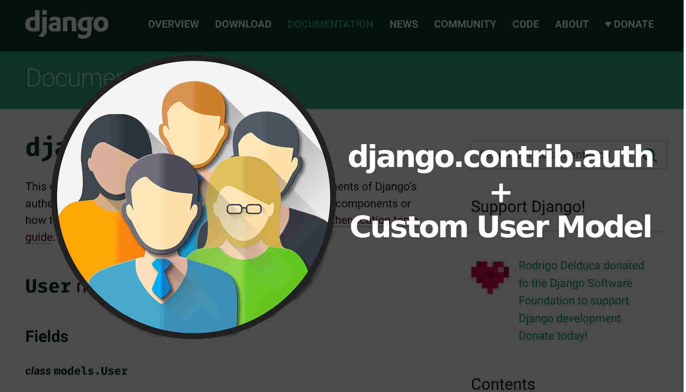

# Django Custom User Model

Django ships with a built-in User model for authentication, however the official Django documentation highly recommends using a custom user model for new projects. The reason is if you want to make any changes to the User model down the road--for example adding a date of birth field--using a custom user model from the beginning makes this quite easy. But if you do not, updating the default User model in an existing Django project is very, very challenging.

## AbstractUser vs AbstractBaseUser

The default User model in Django uses a username to uniquely identify a user during authentication. If you'd rather use an email address, you'll need to create a custom User model by either subclassing AbstractUser or AbstractBaseUser.

Options:

1. *AbstractUser*: Use this option if you are happy with the existing fields on the User model and just want to remove the username field.
2. *AbstractBaseUser*: Use this option if you want to start from scratch by creating your own, completely new User model.

The steps are the same for each:

1. Create a custom User model and Manager
2. Update settings.py
3. Customize the UserCreationForm and UserChangeForm forms
4. Update the admin

We'll use AbstractUser which actually subclasses AbstractBaseUser but provides more default configuration.

### Custom User Model

Creating our initial custom user model requires four steps:

* update config/settings.py
* create a new CustomUser model
* create new UserCreation and UserChangeForm
* update the admin

In settings.py we'll add the accounts app and use the AUTH_USER_MODEL config to tell Django to use our new custom user model in place of the built-in User model. We'll call our custom user model CustomUser.

Within INSTALLED_APPS add accounts at the bottom. Then at the bottom of the entire file, add the AUTH_USER_MODEL config.

## **_references:_**

**_read_**

1. [Django Custum User Model](https://learndjango.com/tutorials/django-custom-user-model)

1. [Creating a Custom User Moel](https://www.youtube.com/watch?v=eCeRC7E8Z7Y&t=59s)

1. [Abstract User, User Profile and Signals in Django](https://www.youtube.com/watch?v=EudKs1HPUfE)

1. [Substituting a custom User model](https://docs.djangoproject.com/en/3.0/topics/auth/customizing/#auth-custom-user)
**_vedio_**

1. [-Django Custom User ](https://www.youtube.com/watch?v=SbU2wdPIcaY)

## Done

[home](../README.md) | [About me](../about-me.md) | [contact me](../contact-me.md)
